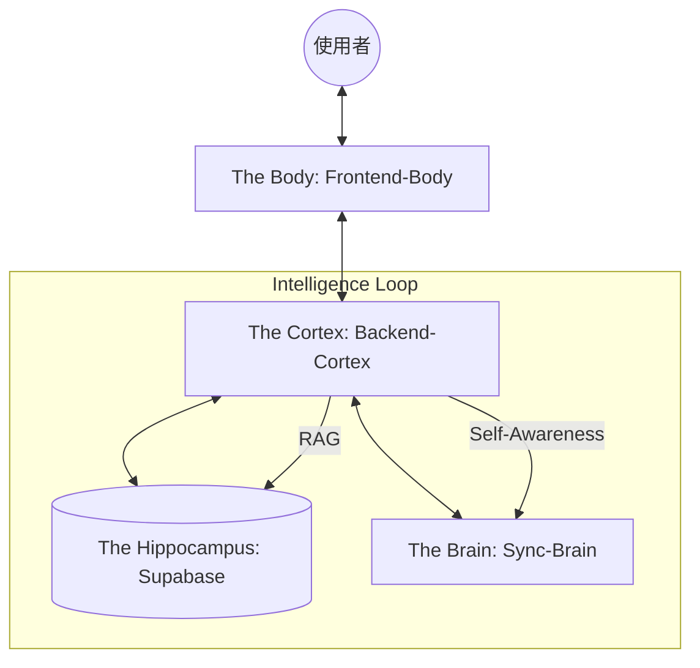

# LifeOS v3.8.5 "Cortex: Actionable Intelligence"

> **自生系統 (Autopoietic OS)**：一個具備自我感知、長期記憶與主動執行能力的個人數位生命體。



---

## 🏗️ 系統層次架構 (System Architecture)

### 1. 🔲 The Body (視覺與交互層) - `frontend-body/`
*   **核心組件**: 
    *   `CaptureView.tsx`: 原始數據採集器，對接後端 Ingest 引擎。
    *   `CortexChat.tsx`: AI 交互中樞，支援即時 RAG 與工具呼叫。
    *   `NeuralGraph.tsx`: 基於 D3.js 的神經網絡視圖，展現記憶關聯。
    *   `ProjectBoard.tsx`: 專案看板，將 AI 洞察轉化為可視化的進度條。

### 2. 🧠 The Cortex (處理與調度層) - `backend-cortex/`
*   **API 核心 (`app/api/v1/`)**:
    *   `ingest.py`: Sorter Agent 邏輯，負責解析、結構化與存儲日記。
    *   `chat.py`: 支援串流回應、檢索與技能動態注入。
    *   `brain.py`: 圖譜數據聚合，提供 nodes 與 edges 的關聯檢索。
*   **服務層 (`app/services/`)**:
    *   `rag_service.py`: 雙軌檢索核心，負責 `memories` 與 `documents` 的統一調度。
    *   `subconscious.py`: 潛意識引擎，負責背景反思與長期洞察生成。
    *   `skills.py`: 技能編排器，依語境自動擴展 AI 能力。

---

## 🗺️ 功能對應矩陣 (Correspondence Map)

| 功能模組 (Module) | 前端組件 (Frontend) | 後端端點 (Backend API) | 資料庫表 (Database) | AI 核心 (AI Engine) |
| :--- | :--- | :--- | :--- | :--- |
| **日記感知** | `CaptureView.tsx` | `POST /ingest` | `memories` | Sorter Agent |
| **智慧對話** | `CortexChat.tsx` | `POST /chat/message` | `memories`, `documents` | RAG & Skill Orchestrator |
| **知識圖譜** | `NeuralGraph.tsx` | `GET /brain/graph` | `nodes`, `edges` | Crystallizer Engine |
| **專案管理** | `ProjectBoard.tsx` | `GET /projects` | `projects`, `tasks` | Actionable Protocol |
| **潛意識反思** | `CardStackDashboard` | `POST /reflect` | `memories` (type: reflection) | Subconscious Engine |

---

## 📂 檔案結構 (Detailed File Tree v3.8.5)

```text
lifeosjxs/
├── README.md                # 📜 [系統宣言] 完整架構與協助能力說明
│
├── 📂 frontend-body/        # 🟦 Window 1: The Body (Next.js 15)
│   ├── package.json         # 📦 前端依賴管理
│   ├── 📂 app/              # 🚀 [路由中樞]
│   │   ├── globals.css      # 🎨 全域樣式 (Neon UI Tokens)
│   │   ├── layout.tsx       # 🏗️ UI 佈局骨架
│   │   └── page.tsx         # 🏠 系統首頁入口 (Dashboard 載入器)
│   ├── 📂 components/       # 🎨 [視覺模組] 系統交互器官
│   │   ├── CaptureView.tsx  # 📝 AI Terminal (日記採集器)
│   │   ├── CortexChat.tsx   # 💬 智慧對話中樞 (RAG & Tools)
│   │   ├── NeuralGraph.tsx  # 🧠 神經圖譜 (D3.js 力導向圖)
│   │   ├── ProjectBoard.tsx # 🏗️ 專案管理面板
│   │   └── TodaySnapshot.tsx# 📅 今日摘要 (API 快照)
│   └── 📂 lib/api/          # 🔌 [神經傳導]
│       └── client.ts        # 🌐 API Client (cortex.ingest / cortex.chat)
│
├── 📂 backend-cortex/       # 🟧 & 🟪 Window 2 & 3: The Cortex (FastAPI)
│   ├── main.py              # 🚪 應用程式入口 (掛載 Routers & Scheduler)
│   ├── requirements.txt     # 📦 Python 核心依賴框架
│   ├── .env                 # 🔑 [私鑰] API Keys & Database Secrets
│   ├── 📂 app/              # 🧠 [大腦邏輯層]
│   │   ├── 📂 core/         # ⚙️ [核心基礎設施]
│   │   │   ├── database.py  # 💾 Supabase Client (單例模式)
│   │   │   └── gemini.py    # 🤖 Model Factory (模型選型與清理)
│   │   ├── 📂 models/       # 📐 [資料結構]
│   │   │   └── schemas.py   # 📝 Pydantic Models (v3.8.1 對齊)
│   │   ├── 📂 api/v1/       # 🌐 [皮質接口] (Routers)
│   │   │   ├── ingest.py    # 📥 感知輸入 (處理 CaptureView)
│   │   │   ├── chat.py      # 💬 智慧對話 (處理 CortexChat)
│   │   │   └── brain.py     # 🕸️ 圖譜與成長端點
│   │   ├── 📂 services/     # 🧪 [功能實作層]
│   │   │   ├── rag_service.py   # 🔎 雙軌檢索 (Unified RAG Engine)
│   │   │   ├── subconscious.py  # 🌑 潛意識自主反思引擎
│   │   │   └── skills.py        # 🛠️ 技能編排器 (Dynamic Skill Loading)
│   ├── 📂 schemas/         # 🧬 [系統基因]
│   │   ├── registry.json    # 📜 DB Schema 絕對對齊 (Supabase Ground Truth)
│   │   └── evolution_log.json # 📈 系統演化歷史紀錄
│   └── 📂 skills/          # 🛠️ [技能手冊]
│       ├── core/           # 任務與專案主動執行技能
│       └── research/       # Web Search 與外部調研技能
│
├── 📂 sync_brain/           # 🧠 The Brain (AI 靈魂中樞 - 開發者必讀)
│   ├── START_HERE.md       # 🌟 AI 開發交接第一站
│   ├── SYSTEM_CONTEXT.md   # 📖 系統架構真理文件
│   └── 📂 prompts/         # 📜 指令集模板 (Cortex/Daily/Review)
│
├── 📂 tools/                # 🔧 開發者工具箱
│   ├── session_start.py     # 🌅 開工日誌啟動
│   ├── session_end.py       # 🌇 收工演化交接
│   └── batch_embed.py       # 補填歷史向量工具
│
└── 📂 database-hippocampus/  # 🟩 Window 4: The Hippocampus
    └── 📂 infra/            # 📐 SQL 初始化與 Migration 指令
```

---

## 💡 系統調整指南 (Adjustment Guide)

如果您想要對系統進行特定深度調整，請參考以下路徑：

### 1. 資料結構 (Data Schema)
*   **修改定義**: 編輯 [schema.prisma](file:///C:/Users/lien.huang/AppData/lifeosjxs/database-hippocampus/prisma/schema.prisma)。
*   **同步 AI**: 更新 [registry.json](file:///C:/Users/lien.huang/AppData/lifeosjxs/backend-cortex/schemas/registry.json) 以確保後端與 AI 識別最新欄位。

### 2. AI 邏輯與人格 (AI Logic & Personality)
*   **技能擴展**: 調整 `backend-cortex/skills/` 下的對應 `SKILL.md`（例如：變更「反思」邏輯）。
*   **核心人格**: 修改 [system_cortex.md](file:///C:/Users/lien.huang/AppData/lifeosjxs/sync_brain/prompts/system_cortex.md) 更改 AI 的語氣與執行準則。

### 3. 前端介面 (Frontend UI)
*   **視覺微調**: 直接在 `frontend-body/components/` 下找到對應組件。系統採用原生 CSS 以確保最大靈活性。

---
---
**協作協議**: 本系統遵守 [人機協作協議 (HUMAN_AI_AGREEMENT.md)](file:///C:/Users/lien.huang/AppData/lifeosjxs/sync_brain/HUMAN_AI_AGREEMENT.md) 進行演化。
**Status**: v3.8.5 | **Commanding**: 蒼禾 | **Dev AI**: Antigravity
