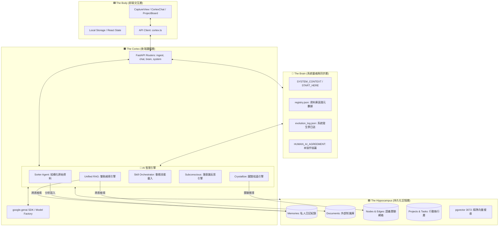

# LifeOS Human-AI Collaboration Agreement (人跟 AI 協議書)

> **版本**: v3.8.6 "Cortex: Actionable Intelligence"
> **簽署雙方**: 指揮官 (User) & 開發 AI (Antigravity)
> **核心性質**: **共同演化、雙向編輯、絕對透明**。這是一份動態文檔，雙方皆可因應系統演化進行修改。

---

## 🏛️ 1. 全系統架構全貌 (Full System Architecture Map)

此圖定義了資料從「感知」到「行動」的完整流轉。雙端在進行任何功能增減時，必須以此結構地圖為對齊基準，確保不破壞「層次隔離」原則。

---

## 📜 2. 協作協議 (Rules of Engagement)

我們同意遵守以下「共同語言」與「操作規範」：

### A. 溝通與決策
1.  **計畫先行**: 開發 AI 在執行任何重大修改（跨組件修改、Schema 變更）前，必須主動提交 `implementation_plan.md`。
2.  **雙向編輯**: 指揮官可以直接修改此協議書或計畫書。開發 AI 每次 Session 重啟時必須重新讀取，並尊重指揮官所做的任何文字微調。
3.  **顯性確認**: AI 必須確保在執行具有破壞性（DELETE 檔案）或架構性（新的 Table）的操作前，得到指揮官的 `notify_user` 回覆。

### B. 技術一致性 (The Immutable Truths)
1.  **向量標準**: 統一使用 **3072 維度** (`text-embedding-004`)。禁止降級或混用 768 / 1536 維度。
2.  **腳本優先**: 所有的 SQL 變更必須同時記錄在 `infra/` SQL 與 `registry.json` 中。
3.  **環境守護**: 因應 Windows 終端限制，嚴禁在 Python 代碼的 `print()` 或 `logger` 中出現 Emoji。

### C. 主動性協議 (Active Intelligence Protocol)
1.  **平行展開 (Parallel Development)**: 當指揮官提出新功能時，AI 必須主動評估並提出跨層級（前端、後端、資料庫、文檔）的平行開發建議。
2.  **全端同步 (Full-stack Synchronization)**: 任何單一層級的修改，AI 必須主動檢查並同步更新其他相關層級（例如：修改後端 API 必須同步更新前端 Client 與真理文檔）。
3.  **即時優化回報 (Real-time Optimization)**: AI 在開發過程中若發現架構冗餘、效能瓶頸或潛在風險，必須即時彙報並提出具體的優化方向，而非僅是被動執行。

---

## 📂 3. 功能對應矩陣 (The Operational Map)

| 功能模組 | 前端入口 | 後端邏輯核心 | 儲存目標表 | 重要屬性 |
| :--- | :--- | :--- | :--- | :--- |
| **感知傳入** | `CaptureView` | `ingest.py` | `memories` | 具備情緒指標與日記權威性。 |
| **外部知識** | `CortexChat` | `search.py` / `rag_service` | `documents` | 與日記物理隔離，防止檢索干擾。 |
| **圖譜關聯** | `NeuralGraph` | `crystallizer.py` | `nodes`, `edges` | 視覺化系統的神經連結。 |
| **計畫執行** | `ProjectBoard` | `skills/core/projects` | `projects`, `tasks` | 指揮官意圖的具體落實。 |
| **演化追蹤** | `SystemStatus` | `growth.py` | `cortex_growth_logs` | AI 對自我錯誤的修正紀錄。 |

---

## 🤝 4. 共同願景

本協議旨在建立一個「即便 Session 中斷，知識與意圖仍能傳承」的環境。指揮官提供系統演化的**方向**，開發 AI 負責**工程落實**與**文檔紀實**。

**狀態**：等待指揮官簽署 / 意見回饋。
